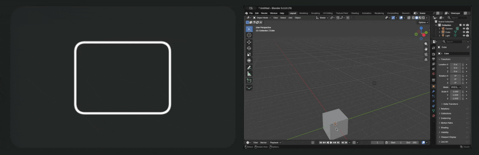
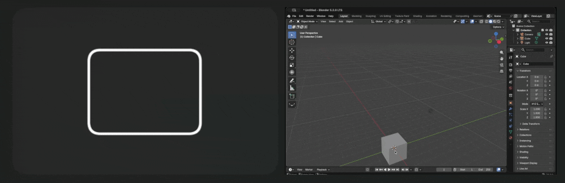
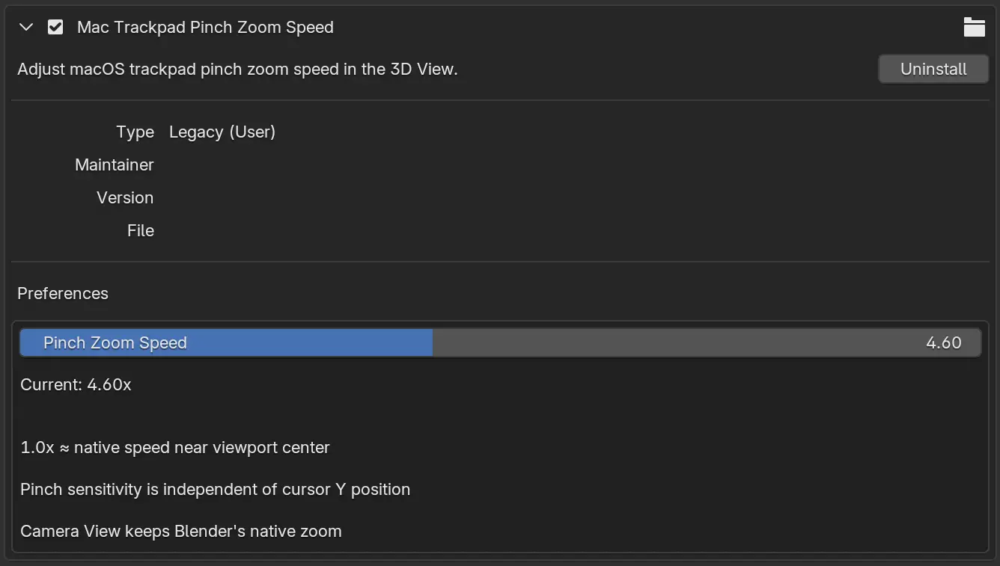

# Blender Mac Trackpad Zoom

Fix inconsistent pinch-zoom sensitivity and adjust trackpad zoom speed in Blender's 3D View on macOS.

This is a small, single-file Blender add-on for a specific problem: in Blender 5.2 on macOS, the same trackpad pinch can zoom at very different speeds depending on the cursor's vertical position. The add-on calculates zoom from the pinch delta without using the cursor's Y position.

> Tested with Blender 5.2.0 LTS on macOS 26.6.2. This is an independent workaround, not an official Blender fix.

## Before and after

| Blender's native behavior near the bottom of the viewport | With the add-on and an adjusted speed |
| --- | --- |
|  |  |

The gestures shown are approximately the same size. The left clip demonstrates the slow native response near the bottom of the viewport; the right clip shows the more useful response after enabling the add-on and increasing the speed.

## What it does

- Makes pinch-zoom sensitivity independent of the cursor's vertical position.
- Provides a `0.50x` to `10.00x` speed control.
- Respects Blender's **Invert Zoom Direction** setting.
- Keeps **Zoom to Mouse Position** behavior.
- Leaves Camera View zoom unchanged.
- Requires no network access, external applications, or Python packages.

## Installation

1. Open the [latest release](../../releases/latest).
2. Download `blender_mac_trackpad_zoom.py`. You can also download the ZIP asset and extract the same Python file from it.
3. Open Blender Preferences and go to **Add-ons**.
4. Open the menu in the upper-right corner and choose **Install from Disk**.
5. Select `blender_mac_trackpad_zoom.py`.
6. Enable **Mac Trackpad Pinch Zoom Speed** if Blender has not enabled it automatically.

You can also download `blender_mac_trackpad_zoom.py` directly from this repository and install it in the same way.

## Settings

Open Blender Preferences, find **Mac Trackpad Pinch Zoom Speed**, and adjust **Pinch Zoom Speed**.

- `1.00x` approximates Blender's native speed near the vertical center of the viewport.
- Higher values make each pinch zoom farther.

Changes take effect immediately.

## Compatibility and scope

- Designed for macOS trackpads, including MacBook trackpads and Magic Trackpad.
- Tested with Blender 5.2.0 LTS on Apple Silicon.
- Camera View intentionally keeps Blender's native zoom behavior.
- Other Blender versions and Intel Macs have not yet been verified.

The add-on relies on the `TRACKPADZOOM` event behavior present in Blender 5.2. If Blender changes that event in another version, the result may differ.

## How it works

In Blender 5.2 on macOS, trackpad magnification reaches Python as a `TRACKPADZOOM` event. Blender's native Dolly calculation can make the zoom factor depend on the cursor's vertical position. This add-on intercepts that event in the 3D View, derives a symmetric exponential zoom factor from the pinch delta, and consumes the event so Blender does not apply a second zoom operation.

When **Zoom to Mouse Position** is enabled, the add-on also moves the view pivot so the point under the cursor remains approximately stationary.

## Uninstall

Open Blender Preferences, find **Mac Trackpad Pinch Zoom Speed**, and choose **Uninstall**. You can disable its checkbox instead if you only want to turn it off temporarily.

## Disclaimer

This software is provided **as is**, without any express or implied warranty. You are responsible for evaluating whether it is suitable for your system and workflow, and you should back up important work and settings before installation. To the maximum extent permitted by applicable law, the author and contributors are not liable for malfunctions, data loss, work interruption, software or hardware problems, or any direct or indirect damages arising from the use of, or inability to use, this software. You use it entirely at your own risk.

## License

Copyright © 2026 jc-liang.

Licensed under the [GNU General Public License v3.0 or later](LICENSE).
